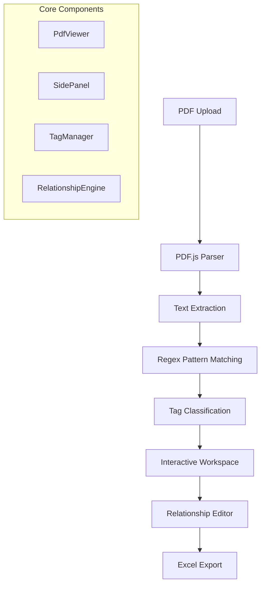

# P&ID Smart Digitizer

<div align="center">


**🎯 Intelligent P&ID digitization tool for engineers**

*Transform complex P&ID diagrams into structured data with AI-powered tag recognition*

[🚀 Live Demo](https://khk9897.github.io/P-ID-Tag-Extractor) | [📖 Documentation](#documentation) | [🛠️ Installation](#installation)

</div>

---

## ✨ Features

### 🧠 Smart Recognition
- **Intelligent Tag Detection**: Advanced regex-based pattern matching for Equipment, Lines, and Instruments
- **Automatic Categorization**: Smart classification of engineering tags by type
- **Custom Pattern Support**: Configurable recognition patterns for project-specific requirements

### 🎨 Interactive Workspace  
- **Visual Tag Management**: Color-coded tag highlighting with category-based organization
- **Advanced Visibility Controls**: Granular show/hide controls for each tag type and relationship category
- **Review System**: Tag review status tracking with checkbox interface and filtering (All/Reviewed/Not Reviewed)
- **Relationship Mapping**: Intuitive connection, installation, and annotation relationship creation
- **Multi-selection Tools**: Advanced selection capabilities with area and multi-tag selection
- **Smart Interaction**: Hidden tags remain selectable while being visually decluttered
- **Page Filtering**: Smart page-only view for focused editing across all entity types
- **Description Management**: Clean read/edit mode toggle for Note & Hold annotations

### 🔐 Privacy-First Design
- **100% Client-Side Processing**: All data stays in your browser - no server uploads
- **Secure by Design**: Zero data transmission ensures complete confidentiality
- **Offline Capable**: Works entirely without internet connectivity

### 📊 Professional Export
- **Structured Excel Output**: Organized sheets for Equipment, Line, Instrument, and Description lists
- **Complete Data Export**: Includes relationships, annotations, Note & Hold data, drawing references, and review status
- **Project Continuity**: Save/load projects with review status preservation for iterative work sessions
- **Auto-linking**: Intelligent Note & Hold association with page-specific numbering

---

## 🚀 Quick Start

### Online Usage
1. **Visit**: [P&ID Smart Digitizer](https://khk9897.github.io/P-ID-Tag-Extractor)
2. **Upload**: Drag and drop your P&ID PDF file
3. **Process**: Wait for automatic tag recognition
4. **Refine**: Review and adjust detected tags
5. **Export**: Download structured Excel reports

### Local Development

```bash
# Clone the repository
git clone https://github.com/khk9897/P-ID-Tag-Extractor.git
cd P-ID-Tag-Extractor

# Install dependencies
npm install

# Start development server
npm run dev

# Build for production
npm run build
```

---

## 📖 Documentation

### 🏗️ Architecture Overview



### 🎯 Tag Categories

| Category | Description | Pattern Example | Color |
|----------|-------------|-----------------|-------|
| **Equipment** | Process equipment tags | `E-101A`, `V-203B` | 🔵 Sky Blue |
| **Line** | Piping and pipeline tags | `P-101-A-6"-CS` | 🔴 Rose |
| **Instrument** | Control & measurement devices | `FT-101`, `PIC-203A` | 🟡 Amber |
| **Drawing Number** | Document references | `P&ID-001-REV-A` | 🟣 Indigo |
| **Notes & Holds** | Special annotations with auto-linking | `NOTE: See spec` | 🟢 Teal |

### ⌨️ Keyboard Shortcuts

<details>
<summary><strong>View All Shortcuts</strong></summary>

#### Navigation & Control
| Shortcut | Function |
|----------|----------|
| `S` | Toggle **S**ide panel |
| `Q` | Previous page |
| `W` | Next page |
| `V` | Toggle relationship **V**iew |

#### View & Mode
| Shortcut | Function |
|----------|----------|
| `1` / `2` | Zoom in / Zoom out |
| `C` | **C**onnect mode toggle |
| `K` | Manual **C**reate mode (Ma**K**e) |

#### Creation & Actions
| Shortcut | Function |
|----------|----------|
| `M` | **M**erge selected text to Instrument |
| `N` | Create **N**ote description |
| `H` | Create **H**old description |
| `P` | Create Equipment Short **S**pec (**P**rocessEquipment) |
| `I` | Create **I**nstallation relationship |
| `R` | Create annotation/**R**elationship |

#### Selection & Control
| Shortcut | Function |
|----------|----------|
| `Esc` | Exit current mode |
| `Delete` | Delete selected items |
| `Ctrl+Click` | Multi-select |
| `Ctrl+Drag` | Area select |

</details>

---

## 🔧 Technical Stack

### Core Technologies
- **Frontend**: React 18 + TypeScript
- **Build Tool**: Vite 6 with optimized chunking
- **PDF Processing**: PDF.js with local worker
- **Styling**: Tailwind CSS with custom components
- **Data Export**: XLSX library for Excel generation

### Key Libraries
```json
{
  "react": "^18.2.0",
  "pdfjs-dist": "^4.10.38",
  "xlsx": "^0.18.5",
  "uuid": "^9.0.0",
  "typescript": "~5.8.2"
}
```

### Performance Optimizations
- **Code Splitting**: Vendor, PDF.js, and XLSX chunks
- **Bundle Size**: ~276KB gzipped total
- **Memory Management**: Efficient PDF rendering with viewport optimization
- **Worker Threading**: PDF.js processing in dedicated worker

---

## 📋 Usage Guide

### 1. File Upload & Processing

```typescript
// Supported formats
const supportedFiles = ['.pdf'];
const maxFileSize = '100MB'; // Recommended
```

### 2. Tag Management Workflow

1. **Automatic Recognition**: Upload triggers pattern matching
2. **Manual Review**: Verify and adjust detected tags  
3. **Review Status Tracking**: Mark tags as reviewed using checkboxes
4. **Custom Creation**: Add tags for unrecognized elements
5. **Relationship Building**: Connect related components

### 3. Relationship Types

#### 🔗 Connection (A → B)
- **Purpose**: Process flow connections
- **Usage**: Connect equipment, lines in sequence
- **Visual**: Solid arrows with flow direction

#### 🔧 Installation (Instrument on Equipment/Line)  
- **Purpose**: Show instrument mounting locations
- **Usage**: Select base + instruments, press `I`
- **Visual**: Yellow arrows indicating installation

#### 📝 Annotation (Tag + Description)
- **Purpose**: Link tags to explanatory text
- **Usage**: Select tags + text, press `R`  
- **Visual**: Gray dashed lines

#### 📋 Note (Tag + Note Tag)
- **Purpose**: Associate tags with special notes
- **Usage**: Select primary tags + note tags, press `R`
- **Visual**: Teal dashed lines

---

## ⚙️ Configuration

### Pattern Customization

Access via Settings button to modify recognition patterns:

```javascript
// Example Equipment pattern
const equipmentPattern = '^([^-]*-){2}[^-]*$';

// Example Instrument pattern  
const instrumentPattern = {
  func: '[A-Z]{2,4}',     // Function code
  num: '\\d{4}(?:\\s?[A-Z])?' // Tag number
};
```

### Tolerance Settings

Fine-tune text combination thresholds:

```javascript
const tolerances = {
  vertical: 15,      // px for combining parts vertically
  horizontal: 20,    // px for combining parts horizontally  
  autoLinkDistance: 50 // px for auto-linking annotations
};
```

---

## 📊 Export Format

### Excel Structure

The generated Excel file contains organized sheets:

#### Equipment List
| Column | Description |
|--------|-------------|
| Tag | Equipment identifier |
| Loop No | Associated control loop |
| Page | Source drawing page |
| Connected From | Input connections |
| Connected To | Output connections |
| Instruments | Installed instruments |
| Description | Associated annotations |
| Notes | Special notes/holds |

#### Line List  
| Column | Description |
|--------|-------------|
| Tag | Line identifier |
| Loop No | Associated control loop |
| Page | Source drawing page |
| Connected From | Origin equipment |
| Connected To | Destination equipment |
| Instruments | Installed instruments |
| Description | Associated annotations |
| Notes | Special notes/holds |

#### Instrument List
| Column | Description |
|--------|-------------|
| Tag | Instrument identifier |
| Loop No | Associated control loop |
| Page | Source drawing page |
| Installed On | Host equipment/line |
| Description | Associated annotations |
| Notes | Special notes/holds |

#### Equipment Short Spec List
| Column | Description |
|--------|-------------|
| Equipment Tag | Associated equipment identifier |
| Service | Service description |
| Short Spec | Equipment specification details |
| Page | Source drawing page |

#### Description List
| Column | Description |
|--------|-------------|
| Number | Auto-generated page-specific numbering |
| Type | Note or Hold classification |
| Scope | General or Specific scope |
| Page | Source drawing page |
| Content | Description text content |
| Related Tags | Associated equipment/line/instrument tags |

---

## 🔒 Privacy & Security

### Data Protection
- **No Server Communication**: All processing occurs client-side
- **Local Storage Only**: Temporary browser storage for session data
- **Zero Data Retention**: No persistent storage on external servers
- **Secure by Default**: No user authentication or data collection

### Browser Requirements
- **Modern Browser**: Chrome 90+, Firefox 88+, Safari 14+
- **JavaScript**: Must be enabled
- **Memory**: Minimum 4GB RAM recommended for large PDFs
- **Storage**: Temporary space for PDF processing

---

## 🤝 Contributing

We welcome contributions! Please see our [Contributing Guidelines](CONTRIBUTING.md) for details.

### Development Workflow

1. **Fork** the repository
2. **Create** a feature branch (`git checkout -b feature/AmazingFeature`)
3. **Commit** your changes (`git commit -m 'Add AmazingFeature'`)
4. **Push** to the branch (`git push origin feature/AmazingFeature`)
5. **Open** a Pull Request

### Code Standards
- **TypeScript**: Strict mode enabled
- **ESLint**: Airbnb configuration
- **Prettier**: Automated formatting
- **Testing**: Jest + React Testing Library

---

## 📄 License

This project is licensed under the MIT License - see the [LICENSE](LICENSE) file for details.

---

## 🙏 Acknowledgments

- **PDF.js Team** - Excellent PDF rendering library
- **React Community** - Robust frontend framework
- **Tailwind CSS** - Utility-first CSS framework
- **Vite Team** - Lightning-fast build tool

---

## 🐛 Issues & Support

**Found a bug?** Please check [existing issues](https://github.com/khk9897/P-ID-Tag-Extractor/issues) before creating a new one.

**Need help?** Check our [FAQ](FAQ.md) or create a [discussion](https://github.com/khk9897/P-ID-Tag-Extractor/discussions).

---

<div align="center">

**Made with ❤️ for the engineering community**

*Transform your P&ID digitization workflow today*

[](https://github.com/khk9897/P-ID-Tag-Extractor/stargazers)
[](https://github.com/khk9897/P-ID-Tag-Extractor/network/members)

</div>