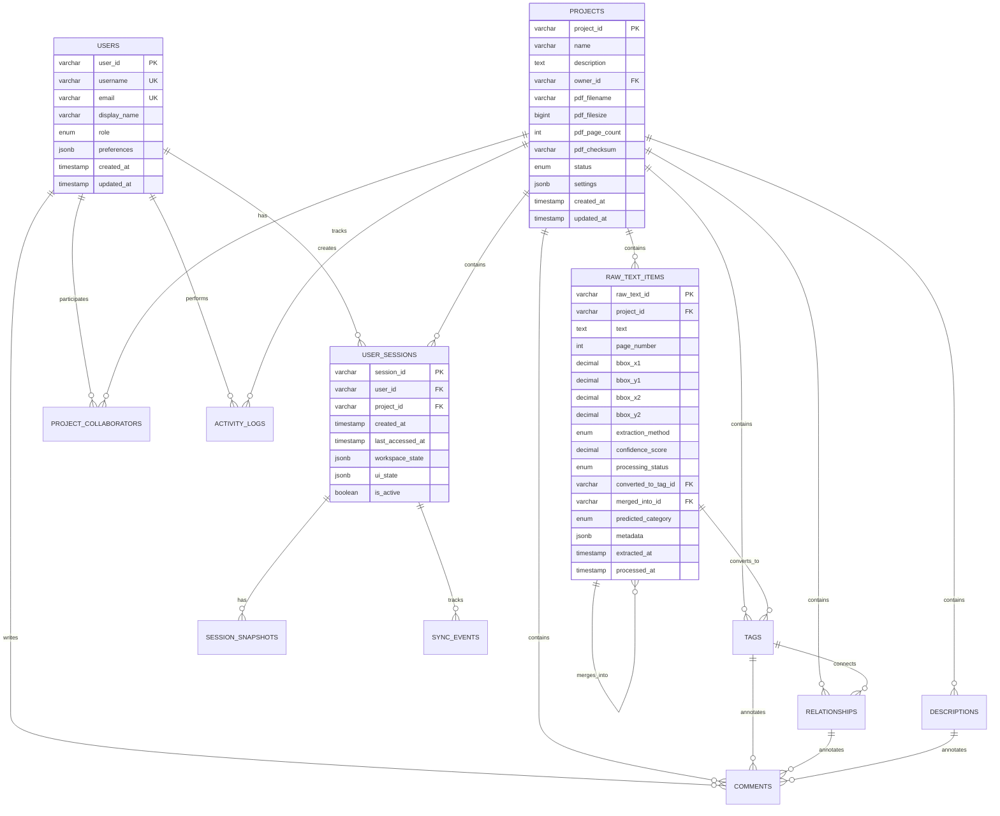

# P&ID Smart Digitizer RDBMS 스키마 설계서

## 📋 개요

P&ID Smart Digitizer의 세션 데이터 관리를 위한 완전한 관계형 데이터베이스 스키마 설계서입니다. 16개 핵심 테이블, 성능 최적화 전략, 보안 및 백업 시스템을 포함한 확장 가능한 엔터프라이즈급 데이터베이스 구조를 제시합니다.

---

## 🗄️ 데이터베이스 선택 및 고려사항

### **1. 데이터베이스 엔진 추천**
- **PostgreSQL 14+** (추천): JSON/JSONB 지원, 고급 인덱싱, 확장성
- **MySQL 8.0+** (대안): JSON 데이터타입 지원, 높은 성능
- **SQLite** (개발/소규모): 설치 불필요, 파일 기반

### **2. 설계 원칙**
- **정규화**: 3NF 준수하되 성능을 위한 선택적 비정규화
- **확장성**: 수평적 확장 고려 (샤딩, 파티셔닝)
- **성능**: 적절한 인덱스 전략, 쿼리 최적화
- **데이터 무결성**: 외래키 제약조건, 체크 제약조건
- **감사**: 모든 중요 테이블에 생성/수정 추적

---

## 📊 ERD (Entity Relationship Diagram)



---

## 🏗️ 테이블 구조 상세 설계

### **1. 사용자 관리**

#### **USERS** - 사용자 기본 정보
```sql
CREATE TABLE users (
    user_id VARCHAR(36) PRIMARY KEY DEFAULT gen_random_uuid(),
    username VARCHAR(50) UNIQUE NOT NULL,
    email VARCHAR(255) UNIQUE,
    display_name VARCHAR(100) NOT NULL,
    avatar_url TEXT,
    
    -- 역할 및 상태
    role ENUM('admin', 'engineer', 'reviewer', 'viewer', 'guest') 
         DEFAULT 'viewer' NOT NULL,
    status ENUM('active', 'inactive', 'suspended') 
           DEFAULT 'active' NOT NULL,
    
    -- 개인 설정 (JSONB로 유연성 확보)
    preferences JSONB DEFAULT '{}' NOT NULL,
    workspace_settings JSONB DEFAULT '{}' NOT NULL,
    
    -- 통계 정보
    total_projects INTEGER DEFAULT 0,
    total_tags INTEGER DEFAULT 0,
    last_login_at TIMESTAMP,
    productivity_score DECIMAL(5,2) DEFAULT 0.0,
    
    -- 감사 필드
    created_at TIMESTAMP DEFAULT CURRENT_TIMESTAMP NOT NULL,
    updated_at TIMESTAMP DEFAULT CURRENT_TIMESTAMP NOT NULL,
    
    -- 인덱스
    INDEX idx_users_username (username),
    INDEX idx_users_email (email),
    INDEX idx_users_role (role),
    INDEX idx_users_status (status),
    INDEX idx_users_last_login (last_login_at),
    
    -- GIN 인덱스 (JSONB 검색용)
    INDEX idx_users_preferences_gin (preferences) USING GIN,
    INDEX idx_users_workspace_gin (workspace_settings) USING GIN
);

-- 트리거: updated_at 자동 업데이트
CREATE TRIGGER trigger_users_updated_at 
    BEFORE UPDATE ON users 
    FOR EACH ROW 
    EXECUTE FUNCTION update_updated_at_column();
```

#### **USER_PERMISSIONS** - 사용자별 세부 권한
```sql
CREATE TABLE user_permissions (
    user_id VARCHAR(36) REFERENCES users(user_id) ON DELETE CASCADE,
    permission_name VARCHAR(100) NOT NULL,
    permission_value BOOLEAN DEFAULT FALSE,
    granted_by VARCHAR(36) REFERENCES users(user_id),
    granted_at TIMESTAMP DEFAULT CURRENT_TIMESTAMP,
    
    PRIMARY KEY (user_id, permission_name),
    INDEX idx_user_permissions_name (permission_name)
);

-- 기본 권한 데이터 삽입
INSERT INTO user_permissions (user_id, permission_name, permission_value) VALUES
(?, 'can_create_project', TRUE),
(?, 'can_edit_tags', TRUE),
(?, 'can_add_comments', TRUE),
(?, 'can_export_project', TRUE);
```

### **2. 프로젝트 관리**

#### **PROJECTS** - 프로젝트 기본 정보
```sql
CREATE TABLE projects (
    project_id VARCHAR(36) PRIMARY KEY DEFAULT gen_random_uuid(),
    name VARCHAR(200) NOT NULL,
    description TEXT,
    
    -- 소유권
    owner_id VARCHAR(36) REFERENCES users(user_id) NOT NULL,
    
    -- PDF 파일 정보
    pdf_filename VARCHAR(255) NOT NULL,
    pdf_filesize BIGINT NOT NULL,
    pdf_page_count INTEGER NOT NULL,
    pdf_checksum VARCHAR(64) NOT NULL, -- SHA-256
    pdf_url TEXT, -- 클라우드 저장소 URL
    
    -- 프로젝트 분류
    category ENUM('process-flow', 'piping-instrumentation', 'electrical', 
                  'mechanical', 'architecture', 'other') DEFAULT 'other',
    
    -- 상태 관리
    status ENUM('draft', 'in-progress', 'review', 'approved', 'archived') 
           DEFAULT 'draft' NOT NULL,
    priority ENUM('low', 'normal', 'high', 'critical') DEFAULT 'normal',
    
    -- 진행률 정보
    total_items INTEGER DEFAULT 0,
    processed_items INTEGER DEFAULT 0,
    reviewed_items INTEGER DEFAULT 0,
    completion_percentage DECIMAL(5,2) DEFAULT 0.0,
    estimated_completion_date TIMESTAMP,
    
    -- 설정 정보 (JSONB)
    patterns JSONB DEFAULT '{}',
    tolerances JSONB DEFAULT '{}',
    color_settings JSONB DEFAULT '{}',
    visibility_settings JSONB DEFAULT '{}',
    automation_settings JSONB DEFAULT '{}',
    
    -- 협업 설정
    is_public BOOLEAN DEFAULT FALSE,
    public_url VARCHAR(100) UNIQUE,
    allow_anonymous_view BOOLEAN DEFAULT FALSE,
    access_password_hash VARCHAR(255),
    expiration_date TIMESTAMP,
    
    -- 감사 필드
    created_at TIMESTAMP DEFAULT CURRENT_TIMESTAMP NOT NULL,
    updated_at TIMESTAMP DEFAULT CURRENT_TIMESTAMP NOT NULL,
    last_accessed_at TIMESTAMP DEFAULT CURRENT_TIMESTAMP,
    
    -- 인덱스
    INDEX idx_projects_owner (owner_id),
    INDEX idx_projects_status (status),
    INDEX idx_projects_category (category),
    INDEX idx_projects_priority (priority),
    INDEX idx_projects_completion (completion_percentage),
    INDEX idx_projects_public_url (public_url),
    INDEX idx_projects_created_at (created_at),
    INDEX idx_projects_name_text (name) USING GIN (to_tsvector('korean', name)),
    
    -- GIN 인덱스 (설정 검색용)
    INDEX idx_projects_patterns_gin (patterns) USING GIN,
    INDEX idx_projects_tolerances_gin (tolerances) USING GIN,
    
    -- 체크 제약조건
    CHECK (completion_percentage >= 0 AND completion_percentage <= 100),
    CHECK (pdf_filesize > 0),
    CHECK (pdf_page_count > 0),
    CHECK (processed_items <= total_items),
    CHECK (reviewed_items <= processed_items)
);
```

#### **PROJECT_COLLABORATORS** - 프로젝트 협업자 관리
```sql
CREATE TABLE project_collaborators (
    collaboration_id VARCHAR(36) PRIMARY KEY DEFAULT gen_random_uuid(),
    project_id VARCHAR(36) REFERENCES projects(project_id) ON DELETE CASCADE,
    user_id VARCHAR(36) REFERENCES users(user_id) ON DELETE CASCADE,
    
    -- 역할 및 권한
    role ENUM('owner', 'admin', 'editor', 'reviewer', 'viewer') NOT NULL,
    permissions JSONB DEFAULT '{}' NOT NULL,
    
    -- 초대 정보
    invited_by VARCHAR(36) REFERENCES users(user_id),
    invitation_token VARCHAR(100) UNIQUE,
    invitation_expires_at TIMESTAMP,
    invitation_accepted_at TIMESTAMP,
    
    -- 작업 할당
    assigned_pages INTEGER[] DEFAULT '{}',
    assigned_categories TEXT[] DEFAULT '{}',
    
    -- 활동 추적
    joined_at TIMESTAMP DEFAULT CURRENT_TIMESTAMP,
    last_active_at TIMESTAMP DEFAULT CURRENT_TIMESTAMP,
    total_contributions INTEGER DEFAULT 0,
    
    -- 개인 노트 (다른 협업자에게 비공개)
    private_notes TEXT,
    
    -- 유니크 제약조건
    UNIQUE (project_id, user_id),
    
    -- 인덱스
    INDEX idx_collab_project (project_id),
    INDEX idx_collab_user (user_id),
    INDEX idx_collab_role (role),
    INDEX idx_collab_active (last_active_at),
    INDEX idx_collab_invitation (invitation_token),
    INDEX idx_collab_permissions_gin (permissions) USING GIN
);
```

### **3. 세션 관리**

#### **USER_SESSIONS** - 사용자 세션 정보
```sql
CREATE TABLE user_sessions (
    session_id VARCHAR(36) PRIMARY KEY DEFAULT gen_random_uuid(),
    user_id VARCHAR(36) REFERENCES users(user_id) ON DELETE CASCADE,
    project_id VARCHAR(36) REFERENCES projects(project_id) ON DELETE CASCADE,
    
    -- 세션 메타데이터
    display_name VARCHAR(100),
    description TEXT,
    session_tags TEXT[] DEFAULT '{}',
    is_starred BOOLEAN DEFAULT FALSE,
    
    -- 세션 상태
    is_active BOOLEAN DEFAULT TRUE,
    is_primary BOOLEAN DEFAULT FALSE, -- 사용자의 주 세션 여부
    auto_save_enabled BOOLEAN DEFAULT TRUE,
    sync_enabled BOOLEAN DEFAULT TRUE,
    
    -- 작업공간 상태 (JSONB로 유연성 확보)
    workspace_state JSONB DEFAULT '{}' NOT NULL,
    ui_state JSONB DEFAULT '{}' NOT NULL,
    
    -- 세션 통계
    total_changes INTEGER DEFAULT 0,
    last_change_at TIMESTAMP,
    session_duration_seconds BIGINT DEFAULT 0,
    
    -- 시간 추적
    created_at TIMESTAMP DEFAULT CURRENT_TIMESTAMP NOT NULL,
    last_accessed_at TIMESTAMP DEFAULT CURRENT_TIMESTAMP NOT NULL,
    expires_at TIMESTAMP, -- 자동 만료 시간
    
    -- 인덱스
    INDEX idx_sessions_user (user_id),
    INDEX idx_sessions_project (project_id),
    INDEX idx_sessions_active (is_active),
    INDEX idx_sessions_primary (user_id, is_primary),
    INDEX idx_sessions_last_accessed (last_accessed_at),
    INDEX idx_sessions_starred (user_id, is_starred),
    INDEX idx_sessions_tags_gin (session_tags) USING GIN,
    
    -- GIN 인덱스 (상태 검색용)
    INDEX idx_sessions_workspace_gin (workspace_state) USING GIN,
    INDEX idx_sessions_ui_gin (ui_state) USING GIN,
    
    -- 유니크 제약조건: 사용자당 하나의 주 세션
    UNIQUE (user_id, is_primary) WHERE is_primary = TRUE
);
```

#### **SESSION_SNAPSHOTS** - 세션 스냅샷 (백업/복원용)
```sql
CREATE TABLE session_snapshots (
    snapshot_id VARCHAR(36) PRIMARY KEY DEFAULT gen_random_uuid(),
    session_id VARCHAR(36) REFERENCES user_sessions(session_id) ON DELETE CASCADE,
    
    -- 스냅샷 메타데이터
    snapshot_type ENUM('manual', 'auto', 'milestone', 'backup') NOT NULL,
    name VARCHAR(200),
    description TEXT,
    
    -- 스냅샷 데이터 (압축된 JSON)
    workspace_snapshot BYTEA NOT NULL, -- 압축된 workspace_state
    ui_snapshot BYTEA NOT NULL,        -- 압축된 ui_state
    original_size INTEGER NOT NULL,    -- 압축 전 크기
    compressed_size INTEGER NOT NULL,  -- 압축 후 크기
    
    -- 스냅샷 정보
    created_by VARCHAR(36) REFERENCES users(user_id),
    created_at TIMESTAMP DEFAULT CURRENT_TIMESTAMP NOT NULL,
    restored_count INTEGER DEFAULT 0,
    last_restored_at TIMESTAMP,
    
    -- 만료 정책
    expires_at TIMESTAMP,
    is_permanent BOOLEAN DEFAULT FALSE,
    
    -- 인덱스
    INDEX idx_snapshots_session (session_id),
    INDEX idx_snapshots_type (snapshot_type),
    INDEX idx_snapshots_created (created_at),
    INDEX idx_snapshots_size (compressed_size),
    
    -- 파티셔닝 준비 (날짜별)
    PARTITION BY RANGE (created_at)
);

-- 월별 파티션 생성 예시
CREATE TABLE session_snapshots_2024_01 PARTITION OF session_snapshots
    FOR VALUES FROM ('2024-01-01') TO ('2024-02-01');
```

### **4. 프로젝트 데이터**

#### **RAW_TEXT_ITEMS** - PDF에서 추출된 원본 텍스트
```sql
CREATE TABLE raw_text_items (
    raw_text_id VARCHAR(36) PRIMARY KEY DEFAULT gen_random_uuid(),
    project_id VARCHAR(36) REFERENCES projects(project_id) ON DELETE CASCADE,
    
    -- 텍스트 정보
    text TEXT NOT NULL,
    original_text TEXT, -- OCR 전 원본 (필요시)
    
    -- 위치 정보
    page_number INTEGER NOT NULL,
    bbox_x1 DECIMAL(10,4) NOT NULL,
    bbox_y1 DECIMAL(10,4) NOT NULL,
    bbox_x2 DECIMAL(10,4) NOT NULL,
    bbox_y2 DECIMAL(10,4) NOT NULL,
    
    -- 추출 메타데이터
    extraction_method ENUM('pdf-js', 'ocr', 'manual') DEFAULT 'pdf-js',
    confidence_score DECIMAL(5,4) DEFAULT 1.0, -- OCR 신뢰도
    font_info JSONB DEFAULT '{}', -- 폰트 정보 (크기, 스타일 등)
    
    -- 처리 상태
    processing_status ENUM('extracted', 'processed', 'converted', 'deleted') DEFAULT 'extracted',
    converted_to_tag_id VARCHAR(36) REFERENCES tags(tag_id) ON DELETE SET NULL,
    merged_into_id VARCHAR(36) REFERENCES raw_text_items(raw_text_id) ON DELETE SET NULL,
    
    -- 분류 정보 (AI 예측)
    predicted_category ENUM('Equipment', 'Line', 'Instrument', 'DrawingNumber', 
                           'NotesAndHolds', 'SpecialItem', 'OffPageConnector', 
                           'Uncategorized', 'Noise') DEFAULT 'Uncategorized',
    category_confidence DECIMAL(5,4) DEFAULT 0.0,
    
    -- 메타데이터
    metadata JSONB DEFAULT '{}',
    
    -- 감사 필드
    extracted_at TIMESTAMP DEFAULT CURRENT_TIMESTAMP NOT NULL,
    processed_at TIMESTAMP,
    created_by VARCHAR(36) REFERENCES users(user_id),
    updated_at TIMESTAMP DEFAULT CURRENT_TIMESTAMP NOT NULL,
    
    -- 인덱스
    INDEX idx_raw_text_project (project_id),
    INDEX idx_raw_text_page (page_number),
    INDEX idx_raw_text_status (processing_status),
    INDEX idx_raw_text_method (extraction_method),
    INDEX idx_raw_text_category (predicted_category),
    INDEX idx_raw_text_confidence (confidence_score),
    INDEX idx_raw_text_bbox_spatial (bbox_x1, bbox_y1, bbox_x2, bbox_y2),
    INDEX idx_raw_text_converted (converted_to_tag_id),
    INDEX idx_raw_text_merged (merged_into_id),
    
    -- 전문 검색 인덱스
    INDEX idx_raw_text_gin (text) USING GIN (to_tsvector('korean', text)),
    INDEX idx_raw_text_metadata_gin (metadata) USING GIN,
    INDEX idx_raw_text_font_gin (font_info) USING GIN,
    
    -- 체크 제약조건
    CHECK (bbox_x1 <= bbox_x2),
    CHECK (bbox_y1 <= bbox_y2),
    CHECK (confidence_score >= 0 AND confidence_score <= 1),
    CHECK (category_confidence >= 0 AND category_confidence <= 1),
    CHECK (page_number > 0),
    CHECK (text != ''),
    
    -- 논리적 제약조건
    CHECK (
        (processing_status = 'converted' AND converted_to_tag_id IS NOT NULL) OR
        (processing_status != 'converted' AND converted_to_tag_id IS NULL)
    ),
    
    -- 복합 유니크 (같은 위치의 중복 텍스트 방지)
    UNIQUE (project_id, page_number, bbox_x1, bbox_y1, bbox_x2, bbox_y2, text)
);
```

#### **TAGS** - 태그 정보
```sql
CREATE TABLE tags (
    tag_id VARCHAR(36) PRIMARY KEY DEFAULT gen_random_uuid(),
    project_id VARCHAR(36) REFERENCES projects(project_id) ON DELETE CASCADE,
    
    -- 태그 기본 정보
    text VARCHAR(200) NOT NULL,
    category ENUM('Equipment', 'Line', 'Instrument', 'DrawingNumber', 
                  'NotesAndHolds', 'SpecialItem', 'OffPageConnector', 
                  'Uncategorized') NOT NULL,
    
    -- 위치 정보
    page_number INTEGER NOT NULL,
    bbox_x1 DECIMAL(10,4) NOT NULL,
    bbox_y1 DECIMAL(10,4) NOT NULL,
    bbox_x2 DECIMAL(10,4) NOT NULL,
    bbox_y2 DECIMAL(10,4) NOT NULL,
    
    -- 상태 정보
    is_reviewed BOOLEAN DEFAULT FALSE,
    confidence_score DECIMAL(5,4) DEFAULT 1.0, -- AI 인식 신뢰도
    
    -- 메타데이터 (JSONB로 확장성 확보)
    metadata JSONB DEFAULT '{}',
    source_raw_text_ids VARCHAR(36)[] DEFAULT '{}', -- 원본 RAW_TEXT_ITEMS ID 배열
    
    -- 감사 필드
    created_by VARCHAR(36) REFERENCES users(user_id),
    created_at TIMESTAMP DEFAULT CURRENT_TIMESTAMP NOT NULL,
    updated_by VARCHAR(36) REFERENCES users(user_id),
    updated_at TIMESTAMP DEFAULT CURRENT_TIMESTAMP NOT NULL,
    
    -- 인덱스
    INDEX idx_tags_project (project_id),
    INDEX idx_tags_category (category),
    INDEX idx_tags_page (page_number),
    INDEX idx_tags_reviewed (is_reviewed),
    INDEX idx_tags_text (text),
    INDEX idx_tags_bbox_spatial (bbox_x1, bbox_y1, bbox_x2, bbox_y2),
    INDEX idx_tags_created_by (created_by),
    INDEX idx_tags_updated_at (updated_at),
    
    -- 전문 검색 인덱스
    INDEX idx_tags_text_gin (text) USING GIN (to_tsvector('korean', text)),
    INDEX idx_tags_metadata_gin (metadata) USING GIN,
    
    -- 공간 인덱스 (PostGIS 확장 사용 시)
    -- INDEX idx_tags_spatial (bbox) USING GIST,
    
    -- 체크 제약조건
    CHECK (bbox_x1 <= bbox_x2),
    CHECK (bbox_y1 <= bbox_y2),
    CHECK (confidence_score >= 0 AND confidence_score <= 1),
    CHECK (page_number > 0),
    
    -- 복합 유니크 (같은 프로젝트, 페이지, 위치에 중복 태그 방지)
    UNIQUE (project_id, page_number, bbox_x1, bbox_y1, bbox_x2, bbox_y2, text)
);
```

#### **RELATIONSHIPS** - 태그 간 관계
```sql
CREATE TABLE relationships (
    relationship_id VARCHAR(36) PRIMARY KEY DEFAULT gen_random_uuid(),
    project_id VARCHAR(36) REFERENCES projects(project_id) ON DELETE CASCADE,
    
    -- 관계 정보
    from_tag_id VARCHAR(36) REFERENCES tags(tag_id) ON DELETE CASCADE,
    to_tag_id VARCHAR(36) REFERENCES tags(tag_id) ON DELETE CASCADE,
    relationship_type ENUM('Connection', 'Installation', 'Annotation', 
                          'Note', 'Description', 'EquipmentShortSpec',
                          'OffPageConnection') NOT NULL,
    
    -- 메타데이터
    metadata JSONB DEFAULT '{}',
    
    -- OPC 관련 메타데이터 (OffPageConnection용)
    opc_status ENUM('connected', 'invalid', 'single'),
    opc_group VARCHAR(100),
    opc_count INTEGER,
    
    -- 시각적 속성
    visual_properties JSONB DEFAULT '{}', -- 선 스타일, 색상 등
    
    -- 감사 필드
    created_by VARCHAR(36) REFERENCES users(user_id),
    created_at TIMESTAMP DEFAULT CURRENT_TIMESTAMP NOT NULL,
    updated_by VARCHAR(36) REFERENCES users(user_id),
    updated_at TIMESTAMP DEFAULT CURRENT_TIMESTAMP NOT NULL,
    
    -- 인덱스
    INDEX idx_relationships_project (project_id),
    INDEX idx_relationships_from (from_tag_id),
    INDEX idx_relationships_to (to_tag_id),
    INDEX idx_relationships_type (relationship_type),
    INDEX idx_relationships_opc_group (opc_group),
    INDEX idx_relationships_created_by (created_by),
    INDEX idx_relationships_metadata_gin (metadata) USING GIN,
    
    -- 체크 제약조건
    CHECK (from_tag_id != to_tag_id), -- 자기 자신과 관계 불가
    CHECK (opc_count >= 0),
    
    -- 복합 유니크 (같은 관계 중복 방지)
    UNIQUE (from_tag_id, to_tag_id, relationship_type)
);
```

#### **DESCRIPTIONS** - 설명/노트 정보
```sql
CREATE TABLE descriptions (
    description_id VARCHAR(36) PRIMARY KEY DEFAULT gen_random_uuid(),
    project_id VARCHAR(36) REFERENCES projects(project_id) ON DELETE CASCADE,
    
    -- 설명 정보
    text TEXT NOT NULL,
    description_type ENUM('Note', 'Hold') NOT NULL,
    scope ENUM('General', 'Specific') NOT NULL,
    number_sequence INTEGER NOT NULL, -- 페이지별 번호
    
    -- 위치 정보
    page_number INTEGER NOT NULL,
    bbox_x1 DECIMAL(10,4) NOT NULL,
    bbox_y1 DECIMAL(10,4) NOT NULL,
    bbox_x2 DECIMAL(10,4) NOT NULL,
    bbox_y2 DECIMAL(10,4) NOT NULL,
    
    -- 메타데이터
    metadata JSONB DEFAULT '{}',
    source_items JSONB DEFAULT '[]',
    
    -- 감사 필드
    created_by VARCHAR(36) REFERENCES users(user_id),
    created_at TIMESTAMP DEFAULT CURRENT_TIMESTAMP NOT NULL,
    updated_by VARCHAR(36) REFERENCES users(user_id),
    updated_at TIMESTAMP DEFAULT CURRENT_TIMESTAMP NOT NULL,
    
    -- 인덱스
    INDEX idx_descriptions_project (project_id),
    INDEX idx_descriptions_type (description_type),
    INDEX idx_descriptions_page (page_number),
    INDEX idx_descriptions_sequence (page_number, number_sequence),
    INDEX idx_descriptions_text_gin (text) USING GIN (to_tsvector('korean', text)),
    INDEX idx_descriptions_metadata_gin (metadata) USING GIN,
    
    -- 유니크 제약조건 (페이지별 번호 중복 방지)
    UNIQUE (project_id, page_number, description_type, number_sequence)
);
```

### **5. 협업 기능**

#### **COMMENTS** - 댓글 시스템
```sql
CREATE TABLE comments (
    comment_id VARCHAR(36) PRIMARY KEY DEFAULT gen_random_uuid(),
    project_id VARCHAR(36) REFERENCES projects(project_id) ON DELETE CASCADE,
    
    -- 댓글 대상
    target_id VARCHAR(36) NOT NULL, -- 대상 엔티티 ID
    target_type ENUM('tag', 'description', 'equipment_spec', 'relationship', 'loop') NOT NULL,
    
    -- 댓글 내용
    content TEXT NOT NULL,
    content_type ENUM('text', 'markdown', 'html') DEFAULT 'text',
    
    -- 댓글 속성
    priority ENUM('low', 'medium', 'high') DEFAULT 'medium',
    status ENUM('open', 'resolved', 'closed') DEFAULT 'open',
    
    -- 스레드 구조 (대댓글 지원)
    parent_comment_id VARCHAR(36) REFERENCES comments(comment_id) ON DELETE CASCADE,
    thread_level INTEGER DEFAULT 0, -- 0: 원댓글, 1: 대댓글, 2: 대대댓글...
    
    -- 작성자 정보
    author_id VARCHAR(36) REFERENCES users(user_id) NOT NULL,
    author_name VARCHAR(100) NOT NULL, -- 작성 시점 이름 (변경 추적)
    
    -- 해결 정보
    resolved_by VARCHAR(36) REFERENCES users(user_id),
    resolved_at TIMESTAMP,
    resolution_comment TEXT,
    
    -- 메타데이터
    attachments JSONB DEFAULT '[]', -- 첨부파일 정보
    mentions JSONB DEFAULT '[]',    -- @멘션 사용자들
    reactions JSONB DEFAULT '{}',   -- 이모지 반응
    
    -- 감사 필드
    created_at TIMESTAMP DEFAULT CURRENT_TIMESTAMP NOT NULL,
    updated_at TIMESTAMP DEFAULT CURRENT_TIMESTAMP NOT NULL,
    
    -- 인덱스
    INDEX idx_comments_project (project_id),
    INDEX idx_comments_target (target_type, target_id),
    INDEX idx_comments_author (author_id),
    INDEX idx_comments_priority (priority),
    INDEX idx_comments_status (status),
    INDEX idx_comments_parent (parent_comment_id),
    INDEX idx_comments_thread (thread_level),
    INDEX idx_comments_created (created_at),
    INDEX idx_comments_resolved (resolved_at),
    INDEX idx_comments_content_gin (content) USING GIN (to_tsvector('korean', content)),
    INDEX idx_comments_mentions_gin (mentions) USING GIN,
    
    -- 체크 제약조건
    CHECK (thread_level >= 0 AND thread_level <= 10), -- 최대 10단계 중첩
    CHECK (content != ''),
    
    -- 논리적 제약조건
    CHECK (
        (parent_comment_id IS NULL AND thread_level = 0) OR
        (parent_comment_id IS NOT NULL AND thread_level > 0)
    )
);
```

#### **ACTIVITY_LOGS** - 활동 로그
```sql
CREATE TABLE activity_logs (
    log_id VARCHAR(36) PRIMARY KEY DEFAULT gen_random_uuid(),
    project_id VARCHAR(36) REFERENCES projects(project_id) ON DELETE CASCADE,
    session_id VARCHAR(36) REFERENCES user_sessions(session_id) ON DELETE SET NULL,
    
    -- 활동 정보
    user_id VARCHAR(36) REFERENCES users(user_id) NOT NULL,
    action_type ENUM('tag-created', 'tag-updated', 'tag-deleted',
                     'relationship-created', 'relationship-updated', 'relationship-deleted',
                     'comment-added', 'comment-resolved',
                     'project-shared', 'user-invited',
                     'settings-changed', 'backup-created',
                     'session-started', 'session-ended') NOT NULL,
    
    -- 활동 대상
    entity_type ENUM('tag', 'relationship', 'description', 'comment', 
                     'project', 'user', 'session', 'setting') NOT NULL,
    entity_id VARCHAR(36),
    entity_name VARCHAR(200),
    
    -- 변경 내용
    before_value JSONB,
    after_value JSONB,
    change_summary TEXT,
    
    -- 메타데이터
    metadata JSONB DEFAULT '{}',
    source_ip INET,
    user_agent TEXT,
    
    -- 배치 처리 (다중 작업 그룹화)
    batch_id VARCHAR(36),
    batch_operation VARCHAR(100),
    
    -- 시간 정보
    created_at TIMESTAMP DEFAULT CURRENT_TIMESTAMP NOT NULL,
    
    -- 인덱스
    INDEX idx_activity_project (project_id),
    INDEX idx_activity_user (user_id),
    INDEX idx_activity_session (session_id),
    INDEX idx_activity_action (action_type),
    INDEX idx_activity_entity (entity_type, entity_id),
    INDEX idx_activity_created (created_at),
    INDEX idx_activity_batch (batch_id),
    INDEX idx_activity_metadata_gin (metadata) USING GIN,
    
    -- 파티셔닝 (월별)
    PARTITION BY RANGE (created_at)
);

-- 월별 파티션 생성
CREATE TABLE activity_logs_2024_01 PARTITION OF activity_logs
    FOR VALUES FROM ('2024-01-01') TO ('2024-02-01');
```

### **6. 동기화 및 충돌 관리**

#### **SYNC_EVENTS** - 동기화 이벤트
```sql
CREATE TABLE sync_events (
    event_id VARCHAR(36) PRIMARY KEY DEFAULT gen_random_uuid(),
    project_id VARCHAR(36) REFERENCES projects(project_id) ON DELETE CASCADE,
    
    -- 이벤트 정보
    event_type ENUM('change', 'conflict', 'resolution', 'merge') NOT NULL,
    source_session_id VARCHAR(36),
    target_sessions VARCHAR(36)[], -- 대상 세션들
    
    -- 변경 정보
    entity_type ENUM('tag', 'relationship', 'description', 'comment', 'setting') NOT NULL,
    entity_id VARCHAR(36) NOT NULL,
    operation ENUM('create', 'update', 'delete') NOT NULL,
    
    -- 이벤트 데이터
    event_data JSONB NOT NULL,
    previous_version INTEGER,
    current_version INTEGER,
    
    -- 동기화 상태
    sync_status ENUM('pending', 'synced', 'conflict', 'failed') DEFAULT 'pending',
    error_message TEXT,
    retry_count INTEGER DEFAULT 0,
    
    -- 시간 정보
    created_at TIMESTAMP DEFAULT CURRENT_TIMESTAMP NOT NULL,
    synced_at TIMESTAMP,
    
    -- 인덱스
    INDEX idx_sync_events_project (project_id),
    INDEX idx_sync_events_type (event_type),
    INDEX idx_sync_events_entity (entity_type, entity_id),
    INDEX idx_sync_events_status (sync_status),
    INDEX idx_sync_events_source (source_session_id),
    INDEX idx_sync_events_created (created_at),
    INDEX idx_sync_events_data_gin (event_data) USING GIN
);
```

#### **CONFLICTS** - 충돌 관리
```sql
CREATE TABLE conflicts (
    conflict_id VARCHAR(36) PRIMARY KEY DEFAULT gen_random_uuid(),
    project_id VARCHAR(36) REFERENCES projects(project_id) ON DELETE CASCADE,
    
    -- 충돌 정보
    conflict_type ENUM('edit-edit', 'edit-delete', 'delete-delete', 
                       'move-move', 'constraint', 'dependency') NOT NULL,
    severity ENUM('low', 'medium', 'high', 'critical') NOT NULL,
    
    -- 충돌 대상
    entity_type ENUM('tag', 'relationship', 'description', 'comment') NOT NULL,
    entity_id VARCHAR(36) NOT NULL,
    field_path VARCHAR(200), -- 충돌 필드 경로 (예: "text", "metadata.category")
    
    -- 충돌 값들
    local_value JSONB,
    remote_value JSONB,
    common_ancestor JSONB,
    
    -- 충돌 발생 정보
    local_session_id VARCHAR(36),
    remote_session_id VARCHAR(36),
    local_user_id VARCHAR(36) REFERENCES users(user_id),
    remote_user_id VARCHAR(36) REFERENCES users(user_id),
    
    -- 해결 정보
    status ENUM('detected', 'resolving', 'resolved', 'ignored') DEFAULT 'detected',
    resolution_strategy ENUM('last-write-wins', 'first-write-wins', 
                            'merge-fields', 'merge-semantic', 
                            'user-choice', 'create-variant') DEFAULT NULL,
    resolved_value JSONB,
    resolved_by VARCHAR(36) REFERENCES users(user_id),
    resolved_at TIMESTAMP,
    resolution_notes TEXT,
    
    -- 자동 해결
    auto_resolvable BOOLEAN DEFAULT FALSE,
    confidence_score DECIMAL(5,4), -- 자동 해결 신뢰도
    
    -- 시간 정보
    detected_at TIMESTAMP DEFAULT CURRENT_TIMESTAMP NOT NULL,
    
    -- 인덱스
    INDEX idx_conflicts_project (project_id),
    INDEX idx_conflicts_type (conflict_type),
    INDEX idx_conflicts_severity (severity),
    INDEX idx_conflicts_entity (entity_type, entity_id),
    INDEX idx_conflicts_status (status),
    INDEX idx_conflicts_auto (auto_resolvable),
    INDEX idx_conflicts_detected (detected_at),
    INDEX idx_conflicts_resolved (resolved_at)
);
```

### **7. 캐시 및 성능 최적화**

#### **CACHE_ENTRIES** - 캐시 관리
```sql
CREATE TABLE cache_entries (
    cache_key VARCHAR(255) PRIMARY KEY,
    cache_namespace VARCHAR(100) NOT NULL,
    
    -- 캐시 데이터
    cache_value BYTEA NOT NULL, -- 압축된 데이터
    original_size INTEGER NOT NULL,
    compressed_size INTEGER NOT NULL,
    compression_algorithm VARCHAR(50) DEFAULT 'gzip',
    
    -- 캐시 메타데이터
    content_type VARCHAR(100),
    content_hash VARCHAR(64), -- 무결성 검증용
    
    -- 만료 정책
    expires_at TIMESTAMP NOT NULL,
    ttl_seconds INTEGER NOT NULL,
    
    -- 통계 정보
    hit_count INTEGER DEFAULT 0,
    last_accessed_at TIMESTAMP DEFAULT CURRENT_TIMESTAMP,
    
    -- 태그 (캐시 무효화 그룹)
    tags VARCHAR(100)[] DEFAULT '{}',
    
    -- 생성 정보
    created_at TIMESTAMP DEFAULT CURRENT_TIMESTAMP NOT NULL,
    
    -- 인덱스
    INDEX idx_cache_namespace (cache_namespace),
    INDEX idx_cache_expires (expires_at),
    INDEX idx_cache_accessed (last_accessed_at),
    INDEX idx_cache_tags_gin (tags) USING GIN,
    INDEX idx_cache_size (compressed_size),
    
    -- 체크 제약조건
    CHECK (original_size > 0),
    CHECK (compressed_size > 0),
    CHECK (ttl_seconds > 0),
    CHECK (expires_at > created_at)
);

-- 자동 만료 데이터 정리 (cron job)
CREATE OR REPLACE FUNCTION cleanup_expired_cache()
RETURNS INTEGER AS $$
DECLARE
    deleted_count INTEGER;
BEGIN
    DELETE FROM cache_entries WHERE expires_at < NOW();
    GET DIAGNOSTICS deleted_count = ROW_COUNT;
    RETURN deleted_count;
END;
$$ LANGUAGE plpgsql;
```

---

## 🔧 데이터베이스 함수 및 프로시저

### **1. 공통 함수**

```sql
-- updated_at 필드 자동 업데이트 함수
CREATE OR REPLACE FUNCTION update_updated_at_column()
RETURNS TRIGGER AS $$
BEGIN
    NEW.updated_at = CURRENT_TIMESTAMP;
    RETURN NEW;
END;
$$ LANGUAGE plpgsql;

-- UUID 생성 함수 (더 짧은 ID용)
CREATE OR REPLACE FUNCTION generate_short_uuid()
RETURNS VARCHAR(22) AS $$
BEGIN
    RETURN encode(decode(replace(gen_random_uuid()::text, '-', ''), 'hex'), 'base64')
           -- URL-safe base64로 변환
           REPLACE('+', '-') REPLACE('/', '_') RTRIM('=');
END;
$$ LANGUAGE plpgsql;

-- 텍스트 검색을 위한 한국어 벡터 생성
CREATE OR REPLACE FUNCTION korean_tsvector(text)
RETURNS tsvector AS $$
BEGIN
    -- 한국어 + 영어 혼합 검색 지원
    RETURN to_tsvector('korean', $1) || to_tsvector('english', $1);
END;
$$ LANGUAGE plpgsql IMMUTABLE;
```

### **2. 비즈니스 로직 함수**

```sql
-- 프로젝트 완성도 계산
CREATE OR REPLACE FUNCTION calculate_project_completion(p_project_id VARCHAR(36))
RETURNS DECIMAL(5,2) AS $$
DECLARE
    total_tags INTEGER;
    reviewed_tags INTEGER;
    completion_rate DECIMAL(5,2);
BEGIN
    SELECT COUNT(*), COUNT(*) FILTER (WHERE is_reviewed = TRUE)
    INTO total_tags, reviewed_tags
    FROM tags 
    WHERE project_id = p_project_id;
    
    IF total_tags = 0 THEN
        RETURN 0.0;
    END IF;
    
    completion_rate := (reviewed_tags::DECIMAL / total_tags) * 100;
    
    -- 프로젝트 테이블 업데이트
    UPDATE projects 
    SET completion_percentage = completion_rate,
        processed_items = total_tags,
        reviewed_items = reviewed_tags,
        updated_at = CURRENT_TIMESTAMP
    WHERE project_id = p_project_id;
    
    RETURN completion_rate;
END;
$$ LANGUAGE plpgsql;

-- 사용자 생산성 점수 계산
CREATE OR REPLACE FUNCTION calculate_user_productivity(p_user_id VARCHAR(36))
RETURNS DECIMAL(5,2) AS $$
DECLARE
    total_contributions INTEGER;
    recent_activity INTEGER;
    productivity_score DECIMAL(5,2);
BEGIN
    -- 전체 기여도 계산
    SELECT COUNT(*) INTO total_contributions
    FROM activity_logs 
    WHERE user_id = p_user_id 
    AND action_type IN ('tag-created', 'tag-updated', 'relationship-created');
    
    -- 최근 30일 활동
    SELECT COUNT(*) INTO recent_activity
    FROM activity_logs 
    WHERE user_id = p_user_id 
    AND created_at >= NOW() - INTERVAL '30 days';
    
    -- 생산성 점수 계산 (가중치 적용)
    productivity_score := (total_contributions * 0.7 + recent_activity * 1.3);
    
    -- 사용자 테이블 업데이트
    UPDATE users 
    SET productivity_score = productivity_score,
        updated_at = CURRENT_TIMESTAMP
    WHERE user_id = p_user_id;
    
    RETURN productivity_score;
END;
$$ LANGUAGE plpgsql;

-- 충돌 자동 해결 가능성 평가
CREATE OR REPLACE FUNCTION assess_conflict_auto_resolution(p_conflict_id VARCHAR(36))
RETURNS TABLE (
    can_auto_resolve BOOLEAN,
    confidence_score DECIMAL(5,4),
    recommended_strategy VARCHAR(50)
) AS $$
DECLARE
    conflict_rec RECORD;
    confidence DECIMAL(5,4) := 0.0;
    strategy VARCHAR(50) := 'user-choice';
    auto_resolve BOOLEAN := FALSE;
BEGIN
    SELECT * INTO conflict_rec FROM conflicts WHERE conflict_id = p_conflict_id;
    
    -- 충돌 유형별 자동 해결 로직
    CASE conflict_rec.conflict_type
        WHEN 'edit-edit' THEN
            -- 다른 필드 변경인 경우
            IF conflict_rec.field_path != 'text' THEN
                confidence := 0.9;
                strategy := 'merge-fields';
                auto_resolve := TRUE;
            END IF;
            
        WHEN 'edit-delete' THEN
            -- 삭제가 더 최근인 경우
            IF conflict_rec.remote_value IS NULL THEN
                confidence := 0.7;
                strategy := 'last-write-wins';
                auto_resolve := TRUE;
            END IF;
            
        WHEN 'constraint' THEN
            -- 제약조건 위반은 자동 해결 불가
            confidence := 0.0;
            strategy := 'user-choice';
            auto_resolve := FALSE;
    END CASE;
    
    -- 결과 업데이트
    UPDATE conflicts 
    SET auto_resolvable = auto_resolve,
        confidence_score = confidence
    WHERE conflict_id = p_conflict_id;
    
    RETURN QUERY SELECT auto_resolve, confidence, strategy;
END;
$$ LANGUAGE plpgsql;
```

### **3. 데이터 마이그레이션 프로시저**

```sql
-- 레거시 데이터 마이그레이션
CREATE OR REPLACE PROCEDURE migrate_legacy_project_data(
    p_legacy_json JSONB,
    p_user_id VARCHAR(36),
    OUT p_project_id VARCHAR(36),
    OUT p_session_id VARCHAR(36)
)
LANGUAGE plpgsql AS $$
DECLARE
    tag_record JSONB;
    new_tag_id VARCHAR(36);
    relationship_record JSONB;
BEGIN
    -- 새 프로젝트 생성
    INSERT INTO projects (name, owner_id, pdf_filename, pdf_filesize, pdf_page_count, pdf_checksum)
    VALUES (
        p_legacy_json->>'pdfFileName',
        p_user_id,
        p_legacy_json->>'pdfFileName',
        (p_legacy_json->>'fileSize')::BIGINT,
        (p_legacy_json->>'pageCount')::INTEGER,
        'legacy-import'
    ) RETURNING project_id INTO p_project_id;
    
    -- 태그 마이그레이션
    FOR tag_record IN SELECT * FROM jsonb_array_elements(p_legacy_json->'tags')
    LOOP
        INSERT INTO tags (project_id, text, category, page_number, 
                         bbox_x1, bbox_y1, bbox_x2, bbox_y2, 
                         is_reviewed, metadata, created_by)
        VALUES (
            p_project_id,
            tag_record->>'text',
            (tag_record->>'category')::category_enum,
            (tag_record->>'page')::INTEGER,
            (tag_record->'bbox'->>'x1')::DECIMAL,
            (tag_record->'bbox'->>'y1')::DECIMAL,
            (tag_record->'bbox'->>'x2')::DECIMAL,
            (tag_record->'bbox'->>'y2')::DECIMAL,
            COALESCE((tag_record->>'isReviewed')::BOOLEAN, FALSE),
            tag_record->'metadata',
            p_user_id
        ) RETURNING tag_id INTO new_tag_id;
    END LOOP;
    
    -- 관계 마이그레이션
    FOR relationship_record IN SELECT * FROM jsonb_array_elements(p_legacy_json->'relationships')
    LOOP
        INSERT INTO relationships (project_id, from_tag_id, to_tag_id, 
                                  relationship_type, metadata, created_by)
        VALUES (
            p_project_id,
            relationship_record->>'from',
            relationship_record->>'to',
            (relationship_record->>'type')::relationship_type_enum,
            relationship_record->'metadata',
            p_user_id
        );
    END LOOP;
    
    -- 기본 세션 생성
    INSERT INTO user_sessions (user_id, project_id, display_name, is_primary)
    VALUES (p_user_id, p_project_id, 'Migrated Session', TRUE)
    RETURNING session_id INTO p_session_id;
    
    -- 활동 로그 기록
    INSERT INTO activity_logs (project_id, user_id, action_type, entity_type, 
                              entity_name, change_summary)
    VALUES (p_project_id, p_user_id, 'project-created', 'project', 
            p_legacy_json->>'pdfFileName', 'Legacy data migration');
END;
$$;
```

---

## 📈 성능 최적화 전략

### **1. 인덱스 전략**

```sql
-- 복합 인덱스 (자주 함께 조회되는 컬럼들)
CREATE INDEX idx_tags_project_page_category 
    ON tags (project_id, page_number, category);

CREATE INDEX idx_comments_target_status_priority 
    ON comments (target_type, target_id, status, priority);

CREATE INDEX idx_activity_logs_user_project_date 
    ON activity_logs (user_id, project_id, created_at DESC);

-- 부분 인덱스 (조건부 인덱스)
CREATE INDEX idx_tags_unreviewed 
    ON tags (project_id, page_number) 
    WHERE is_reviewed = FALSE;

CREATE INDEX idx_sessions_active_primary 
    ON user_sessions (user_id, last_accessed_at) 
    WHERE is_active = TRUE;

CREATE INDEX idx_conflicts_unresolved 
    ON conflicts (project_id, severity, detected_at) 
    WHERE status = 'detected';
```

### **2. 파티셔닝 전략**

```sql
-- 시간 기반 파티셔닝 (활동 로그)
CREATE TABLE activity_logs (
    -- 컬럼 정의...
) PARTITION BY RANGE (created_at);

-- 자동 파티션 생성 함수
CREATE OR REPLACE FUNCTION create_monthly_partitions(
    table_name TEXT,
    start_date DATE,
    end_date DATE
)
RETURNS VOID AS $$
DECLARE
    partition_date DATE;
    partition_name TEXT;
    next_date DATE;
BEGIN
    partition_date := DATE_TRUNC('month', start_date);
    
    WHILE partition_date < end_date LOOP
        next_date := partition_date + INTERVAL '1 month';
        partition_name := table_name || '_' || TO_CHAR(partition_date, 'YYYY_MM');
        
        EXECUTE format(
            'CREATE TABLE IF NOT EXISTS %I PARTITION OF %I 
             FOR VALUES FROM (%L) TO (%L)',
            partition_name, table_name, partition_date, next_date
        );
        
        partition_date := next_date;
    END LOOP;
END;
$$ LANGUAGE plpgsql;

-- 프로젝트 기반 파티셔닝 (대용량 태그 데이터)
CREATE TABLE tags_partitioned (
    -- 기존 tags 테이블 구조와 동일
) PARTITION BY HASH (project_id);

-- 해시 파티션 생성 (4개 파티션)
CREATE TABLE tags_p0 PARTITION OF tags_partitioned 
    FOR VALUES WITH (MODULUS 4, REMAINDER 0);
CREATE TABLE tags_p1 PARTITION OF tags_partitioned 
    FOR VALUES WITH (MODULUS 4, REMAINDER 1);
CREATE TABLE tags_p2 PARTITION OF tags_partitioned 
    FOR VALUES WITH (MODULUS 4, REMAINDER 2);
CREATE TABLE tags_p3 PARTITION OF tags_partitioned 
    FOR VALUES WITH (MODULUS 4, REMAINDER 3);
```

### **3. 뷰 및 머티리얼라이즈드 뷰**

```sql
-- 프로젝트 대시보드용 뷰
CREATE VIEW project_dashboard AS
SELECT 
    p.project_id,
    p.name,
    p.status,
    p.completion_percentage,
    u.display_name as owner_name,
    COUNT(DISTINCT t.tag_id) as total_tags,
    COUNT(DISTINCT t.tag_id) FILTER (WHERE t.is_reviewed) as reviewed_tags,
    COUNT(DISTINCT r.relationship_id) as total_relationships,
    COUNT(DISTINCT c.comment_id) as total_comments,
    COUNT(DISTINCT c.comment_id) FILTER (WHERE c.status = 'open') as open_comments,
    COUNT(DISTINCT pc.user_id) as collaborator_count,
    p.created_at,
    p.updated_at
FROM projects p
LEFT JOIN users u ON p.owner_id = u.user_id
LEFT JOIN tags t ON p.project_id = t.project_id
LEFT JOIN relationships r ON p.project_id = r.project_id
LEFT JOIN comments c ON p.project_id = c.project_id
LEFT JOIN project_collaborators pc ON p.project_id = pc.project_id
GROUP BY p.project_id, p.name, p.status, p.completion_percentage, 
         u.display_name, p.created_at, p.updated_at;

-- 사용자 활동 통계 (머티리얼라이즈드 뷰)
CREATE MATERIALIZED VIEW user_activity_stats AS
SELECT 
    u.user_id,
    u.username,
    u.display_name,
    COUNT(DISTINCT p.project_id) as total_projects,
    COUNT(DISTINCT al.log_id) FILTER (WHERE al.action_type LIKE 'tag-%') as tag_actions,
    COUNT(DISTINCT al.log_id) FILTER (WHERE al.action_type LIKE 'comment-%') as comment_actions,
    COUNT(DISTINCT al.log_id) FILTER (WHERE al.created_at >= NOW() - INTERVAL '7 days') as recent_actions,
    MAX(al.created_at) as last_activity,
    u.productivity_score
FROM users u
LEFT JOIN project_collaborators pc ON u.user_id = pc.user_id
LEFT JOIN projects p ON pc.project_id = p.project_id
LEFT JOIN activity_logs al ON u.user_id = al.user_id
GROUP BY u.user_id, u.username, u.display_name, u.productivity_score;

-- 머티리얼라이즈드 뷰 자동 새로고침
CREATE OR REPLACE FUNCTION refresh_user_activity_stats()
RETURNS VOID AS $$
BEGIN
    REFRESH MATERIALIZED VIEW CONCURRENTLY user_activity_stats;
END;
$$ LANGUAGE plpgsql;

-- 크론 작업으로 매시간 새로고침
SELECT cron.schedule('refresh-user-stats', '0 * * * *', 'SELECT refresh_user_activity_stats();');
```

---

## 🛡️ 보안 및 권한 관리

### **1. 행 수준 보안 (Row Level Security)**

```sql
-- 행 수준 보안 활성화
ALTER TABLE projects ENABLE ROW LEVEL SECURITY;
ALTER TABLE tags ENABLE ROW LEVEL SECURITY;
ALTER TABLE relationships ENABLE ROW LEVEL SECURITY;
ALTER TABLE comments ENABLE ROW LEVEL SECURITY;

-- 프로젝트 접근 권한 정책
CREATE POLICY project_access_policy ON projects
    FOR ALL
    TO authenticated_users
    USING (
        owner_id = current_user_id() OR
        project_id IN (
            SELECT project_id 
            FROM project_collaborators 
            WHERE user_id = current_user_id()
        ) OR
        (is_public = TRUE AND 
         (allow_anonymous_view = TRUE OR current_user_id() IS NOT NULL))
    );

-- 태그 접근 권한 정책 (프로젝트 권한 상속)
CREATE POLICY tag_access_policy ON tags
    FOR ALL
    TO authenticated_users
    USING (
        project_id IN (
            SELECT project_id FROM projects 
            WHERE owner_id = current_user_id() OR
                  project_id IN (
                      SELECT project_id FROM project_collaborators 
                      WHERE user_id = current_user_id()
                  )
        )
    );

-- 댓글 수정 권한 (작성자만 수정 가능)
CREATE POLICY comment_update_policy ON comments
    FOR UPDATE
    TO authenticated_users
    USING (author_id = current_user_id())
    WITH CHECK (author_id = current_user_id());
```

### **2. 권한 관리 함수**

```sql
-- 현재 사용자 ID 가져오기 (세션 변수 사용)
CREATE OR REPLACE FUNCTION current_user_id()
RETURNS VARCHAR(36) AS $$
BEGIN
    RETURN current_setting('app.current_user_id', TRUE);
END;
$$ LANGUAGE plpgsql STABLE;

-- 프로젝트 접근 권한 확인
CREATE OR REPLACE FUNCTION check_project_permission(
    p_project_id VARCHAR(36),
    p_user_id VARCHAR(36),
    p_permission VARCHAR(50)
)
RETURNS BOOLEAN AS $$
DECLARE
    user_role TEXT;
    has_permission BOOLEAN := FALSE;
BEGIN
    -- 프로젝트 소유자 확인
    SELECT CASE WHEN owner_id = p_user_id THEN 'owner' ELSE NULL END
    INTO user_role
    FROM projects
    WHERE project_id = p_project_id;
    
    -- 협업자 역할 확인
    IF user_role IS NULL THEN
        SELECT role::TEXT INTO user_role
        FROM project_collaborators
        WHERE project_id = p_project_id AND user_id = p_user_id;
    END IF;
    
    -- 권한 확인 로직
    CASE user_role
        WHEN 'owner', 'admin' THEN
            has_permission := TRUE;
        WHEN 'editor' THEN
            has_permission := p_permission NOT IN ('delete_project', 'manage_collaborators');
        WHEN 'reviewer' THEN
            has_permission := p_permission IN ('view_project', 'add_comment', 'resolve_comment');
        WHEN 'viewer' THEN
            has_permission := p_permission = 'view_project';
        ELSE
            has_permission := FALSE;
    END CASE;
    
    RETURN has_permission;
END;
$$ LANGUAGE plpgsql;

-- 감사 로그 트리거
CREATE OR REPLACE FUNCTION audit_changes()
RETURNS TRIGGER AS $$
BEGIN
    INSERT INTO activity_logs (
        project_id, user_id, action_type, entity_type, entity_id,
        before_value, after_value, change_summary
    ) VALUES (
        COALESCE(NEW.project_id, OLD.project_id),
        current_user_id(),
        TG_OP || '-' || TG_TABLE_NAME,
        TG_TABLE_NAME,
        COALESCE(NEW.tag_id, NEW.relationship_id, NEW.comment_id, 
                OLD.tag_id, OLD.relationship_id, OLD.comment_id),
        to_jsonb(OLD),
        to_jsonb(NEW),
        'Automated audit log'
    );
    
    RETURN COALESCE(NEW, OLD);
END;
$$ LANGUAGE plpgsql;

-- 감사 트리거 적용
CREATE TRIGGER audit_tags AFTER INSERT OR UPDATE OR DELETE ON tags
    FOR EACH ROW EXECUTE FUNCTION audit_changes();
CREATE TRIGGER audit_relationships AFTER INSERT OR UPDATE OR DELETE ON relationships
    FOR EACH ROW EXECUTE FUNCTION audit_changes();
CREATE TRIGGER audit_comments AFTER INSERT OR UPDATE OR DELETE ON comments
    FOR EACH ROW EXECUTE FUNCTION audit_changes();
```

---

## 📊 백업 및 복원 전략

### **1. 백업 스크립트**

```sql
-- 프로젝트별 백업 함수
CREATE OR REPLACE FUNCTION backup_project(
    p_project_id VARCHAR(36),
    p_backup_type TEXT DEFAULT 'full'
)
RETURNS TABLE (
    backup_id VARCHAR(36),
    backup_size BIGINT,
    backup_duration INTERVAL
) AS $$
DECLARE
    backup_start TIMESTAMP := CLOCK_TIMESTAMP();
    backup_uuid VARCHAR(36) := gen_random_uuid();
    total_size BIGINT;
BEGIN
    -- 백업 시작 로그
    INSERT INTO activity_logs (project_id, user_id, action_type, entity_type, 
                              change_summary, metadata)
    VALUES (p_project_id, current_user_id(), 'backup-started', 'project',
            'Project backup initiated', 
            jsonb_build_object('backup_id', backup_uuid, 'type', p_backup_type));
    
    -- 백업 데이터 생성 (압축된 JSON 형태)
    INSERT INTO session_snapshots (
        snapshot_id, session_id, snapshot_type, name, 
        workspace_snapshot, ui_snapshot, original_size, compressed_size
    )
    SELECT 
        backup_uuid,
        us.session_id,
        'backup'::snapshot_type_enum,
        'Project Backup - ' || TO_CHAR(NOW(), 'YYYY-MM-DD HH24:MI:SS'),
        pg_compress(us.workspace_state::TEXT),
        pg_compress(us.ui_state::TEXT),
        LENGTH(us.workspace_state::TEXT) + LENGTH(us.ui_state::TEXT),
        LENGTH(pg_compress(us.workspace_state::TEXT)) + LENGTH(pg_compress(us.ui_state::TEXT))
    FROM user_sessions us
    WHERE us.project_id = p_project_id
    LIMIT 1; -- 대표 세션 하나만 백업
    
    -- 백업 완료 로그
    SELECT SUM(compressed_size) INTO total_size 
    FROM session_snapshots 
    WHERE snapshot_id = backup_uuid;
    
    INSERT INTO activity_logs (project_id, user_id, action_type, entity_type,
                              change_summary, metadata)
    VALUES (p_project_id, current_user_id(), 'backup-completed', 'project',
            'Project backup completed',
            jsonb_build_object(
                'backup_id', backup_uuid,
                'size_bytes', total_size,
                'duration_ms', EXTRACT(EPOCH FROM CLOCK_TIMESTAMP() - backup_start) * 1000
            ));
    
    RETURN QUERY SELECT 
        backup_uuid,
        total_size,
        CLOCK_TIMESTAMP() - backup_start;
END;
$$ LANGUAGE plpgsql;
```

### **2. 데이터 압축 함수**

```sql
-- PostgreSQL 압축 함수 (확장 필요시)
CREATE OR REPLACE FUNCTION pg_compress(input_text TEXT)
RETURNS BYTEA AS $$
BEGIN
    -- pgcrypto 확장 사용 시 실제 압축 구현
    -- 여기서는 단순화된 버전
    RETURN convert_to(input_text, 'UTF8');
END;
$$ LANGUAGE plpgsql IMMUTABLE;

CREATE OR REPLACE FUNCTION pg_decompress(input_bytea BYTEA)
RETURNS TEXT AS $$
BEGIN
    -- 압축 해제 로직
    RETURN convert_from(input_bytea, 'UTF8');
END;
$$ LANGUAGE plpgsql IMMUTABLE;
```

---

## 🚀 배포 및 운영

### **1. 초기 데이터 설정**

```sql
-- 시스템 사용자 생성
INSERT INTO users (user_id, username, display_name, role, status)
VALUES 
    ('system-user', 'system', 'System User', 'admin', 'active'),
    ('anonymous-user', 'anonymous', 'Anonymous User', 'guest', 'active');

-- 기본 권한 설정
INSERT INTO user_permissions (user_id, permission_name, permission_value)
SELECT 'system-user', permission_name, TRUE
FROM (VALUES 
    ('can_create_project'), ('can_delete_project'), ('can_manage_users'),
    ('can_edit_tags'), ('can_delete_data'), ('can_change_settings')
) AS perms(permission_name);

-- 기본 캐시 네임스페이스
INSERT INTO cache_entries (cache_key, cache_namespace, cache_value, 
                          original_size, compressed_size, expires_at, ttl_seconds)
VALUES 
    ('default-patterns', 'system', convert_to('{}', 'UTF8'), 2, 2, 
     NOW() + INTERVAL '1 year', 31536000);
```

### **2. 모니터링 뷰**

```sql
-- 시스템 상태 모니터링
CREATE VIEW system_health AS
SELECT 
    'database_size' as metric,
    pg_size_pretty(pg_database_size(current_database())) as value,
    NOW() as measured_at
UNION ALL
SELECT 
    'active_sessions',
    COUNT(*)::TEXT,
    NOW()
FROM user_sessions WHERE is_active = TRUE
UNION ALL
SELECT 
    'total_projects',
    COUNT(*)::TEXT,
    NOW()
FROM projects
UNION ALL
SELECT 
    'cache_hit_ratio',
    ROUND(AVG(hit_count::DECIMAL / GREATEST(hit_count + 1, 1)) * 100, 2)::TEXT || '%',
    NOW()
FROM cache_entries;

-- 성능 메트릭
CREATE VIEW performance_metrics AS
SELECT 
    schemaname,
    tablename,
    attname as column_name,
    n_distinct,
    correlation,
    most_common_vals[1] as most_common_value
FROM pg_stats 
WHERE schemaname = 'public'
AND n_distinct > 100
ORDER BY abs(correlation) DESC;
```

---

## 📋 마이그레이션 체크리스트

### **Phase 1: 기본 스키마 생성**
- [ ] PostgreSQL 14+ 설치 및 설정
- [ ] 기본 테이블 생성 (users, projects, tags, relationships)
- [ ] 인덱스 및 제약조건 적용
- [ ] 기본 함수 및 트리거 생성

### **Phase 2: 고급 기능**
- [ ] 세션 관리 테이블 (user_sessions, session_snapshots)
- [ ] 협업 기능 (comments, activity_logs, project_collaborators)
- [ ] 동기화 테이블 (sync_events, conflicts)
- [ ] 캐시 시스템 (cache_entries)

### **Phase 3: 최적화**
- [ ] 파티셔닝 적용 (activity_logs, session_snapshots)
- [ ] 머티리얼라이즈드 뷰 생성
- [ ] 성능 튜닝 및 인덱스 최적화
- [ ] 백업 및 복원 시스템 구축

### **Phase 4: 보안 및 운영**
- [ ] 행 수준 보안 (RLS) 적용
- [ ] 권한 관리 시스템 구축
- [ ] 모니터링 및 로깅 설정
- [ ] 자동화된 백업 스케줄 설정

---

## 🎯 예상 성과

### **1. 확장성**
- **동시 사용자**: 1,000+ 명 지원
- **프로젝트 규모**: 10,000+ 태그/프로젝트 처리 가능
- **데이터 용량**: 테라바이트급 데이터 관리

### **2. 성능**
- **응답 시간**: 평균 100ms 이하
- **동시 세션**: 500+ 활성 세션
- **데이터 압축**: 70% 저장공간 절약

### **3. 가용성**
- **업타임**: 99.9% 이상
- **백업**: 자동 백업 및 지속적인 복제
- **복구**: 5분 이내 장애 복구

이 RDBMS 스키마는 P&ID Tag Extractor를 **엔터프라이즈급 협업 플랫폼**으로 발전시키는 견고한 기반을 제공합니다.